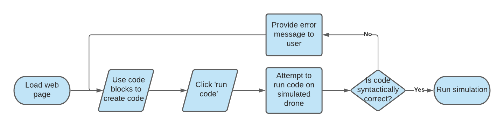
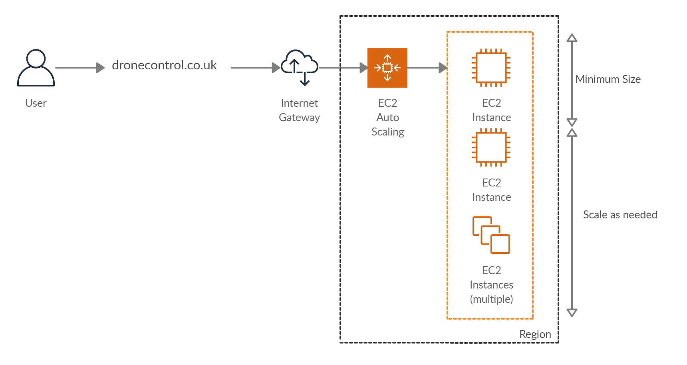

# Portfolio A

## Overview
Faculty of Engineering in University of Bristol via Industrial Liaison Office is working in partnership with Boeing to create outreach activities. The purpose of this activity is to engage students with coding. The head of the project is Steve Bullock, lecturer in University of Bristol. His area of research is dynamics and control of automated air-to-air refuelling. Currently, he is working on Drone Control project in University Flight Lab.

The aim of the project is to create an interactive platform for users to learn and use basic coding concepts in an accessible format. The users will learn how to code by controlling a simulated drone. The digital version of the drone will repeat the behaviour of the real one. Also, the users will be able to engage with control system design in a limited form.  By changing basic settings, they will be able to observe how drone’s flight behaviour was affected. 

Our vision for the product solution is to implement a website containing an interactive maze game. The goal of the game is to make the drone reach the destination via the shortest path possible. The drone will be controlled either by code blocks or manually using the keypad. To achieve the realistic behaviour of the drone, we will use an open source project by AUTONAVx.  The site will not store any personal data, which implies that the progress will not be saved as well. The user interface and the product functionality will be easily understandable for students aged 11-18.

## Requirements

### Stakeholders

#### Steve Bullock
Steve Bullock is our primary client and lead of the Drone Control project. He will be overseeing development during the project with us and maintenance or further development for the foreseeable future of the product whether that be with us or other parties.

User Stories:

1. As the client I want the software to be well documented so that it is extendable by original and future developers.
    - This can be achieved by keeping the code base clean and writing self-documenting code, when this is not possible detailed comments will be left. In-depth documentation will also be provided for when comments are not enough.

    
2. As the client I want the website to support a minimum of 50 concurrent users so that it can be used in a classroom setting.
    - We plan to use react to allow us to do a lot, if not all, of the processing in the users' browser, creating less of a load on our servers meaning it should be scalable to as many clients as necessary. 
3. As the client I want a way to save coding progress so that users can come back to their work or share work with other users.
    - Steve suggested the programs users create could be hashed/encrypted into a unique code to allow for easy sharing of work. This could likely be achieved as the users build programs using 'Scratch'-style blocks meaning there are limited possibilities for how a program is created. The unique code could use hexadecimal or similar to shorten the length of the codes while leaving us with enough data for all the possibilities.
    - To achieve this we need to decide on an encoding strategy and decide how blocks will be encoded with this, possibly looking at compression techniques to shorten code.#
    
4. As the client I want the website to remain online and usable for 5 years as to get maximum benefit to a large number of students.

#### Boeing
Boeing is not directly involved in the development progress, however, they support the project and if funding is required they will provide it. In future years if the software needs major changes or maintenance and we are not able to provide it, this may be outsourced to Boeing where they use internal staff or find external help.

User Stories:

1. As the investor I want the software to remain online and usable for 5 years so that a positive impact from the investment can be seen.
2. As the maintainer I want the software to be well documented and extendable so that in the future we can easily work on the software.

#### ILO (Industrial Liaison Office)
The ILO is acting as an intermediary between internal clients (Steve Bullock) and external (Boeing). This could extend into the future after the project is completed if we decide to continue maintaining the project and working with Boeing while we are students.

#### SRAA (Student Recruitment Access and Admissions)

SRAA via the faculty engagment officer (Roisin Quinn) will be the lead on outreach with the software, running  e with younger students to increase interest in programming and/or Engineering. The software is aimed at users age 11-16 with the possibility of making it accessible to users from age 6.

User Stories:

1. As the outreach lead I want the software to be accessible to users from age 11-16 so that a large range of students can take part (KS3 & KS4).
2. As the outreach lead I want the website to run on recent Chrome, Firefox, Safari on Win/Mac desktop as to allow as many users as possible to have easy access.

#### Users (Students)
The users of the website will be students ages 11-16, the difference in ability that could arise due to the age gap will be accounted for and increasing accessibility is a priority for this project.

User Stories:

1. As the user I want the website to be straightforward and easy to use so that I do not have to spend a lot of time learning how to use it.
2. As the user I want to have a large range of 'Scratch'-style code blocks to allow me to create more sophisticated programs. 

### Functional & Non-Functional Requirements

#### Functional

| Code | Description | Requirement Met | Tested | Test Evidence |
|:------:|-------------|:-----------------:|:--------:|:--------:|
|**1**| **Must be as widely accessibly as possible** | No | No |
|1.1| Must run on recent Chrome, Firefox and Safari. This can be achieved by using react as it supports all popular modern browsers. | | | |
|1.2| Must run on Windows, Mac and Linux. As we are using react all operating systems should be supported as long as they have a web browser with javascript enabled. | | | |
|1.3| Must be useable on less powerful systems. We should be able to achieve this by writing efficient code and keeping dependencies to a minimum.| | | |
|**2**| **Support minimum 50 concurrent users, scalable to more.** As all processing will be done in users browser, should be scalable to as many users as needed.|  |
|**3**| **Remain online and usable for 5 years.** |  |
|3.1| Purchase domain name for 5 years. | | |
|3.2| Rent cloud server for hosting for 5 years. | | |
|3.3| Have maintanable, well documented code so that if needed, anyone is able to extend or bug fix the program. | | |
|**4**| **Have functionality to save users program progress.** |  |
|4.1| Have reversible algorithm to convert 'Scratch-style' code blocks into encoded string. | | |
|4.1.1| Have an encoding for each type of block, e.g 'for', 'forward', 'rotate' etc. | | |
|4.1.2| Implement some sort of lossless compression to reduce size of encoded strings. | | |
|4.1.3| Have function that can convert encoded string back to code blocks and load into program. | | |
|4.2| Have functionality to enter encoded string to load saved code. | | |

#### Non-Functional

| Description | Requirement Met | Tested | Test Evidence |
|-------------|:-----------------:|:--------:|:--------:|
| Be accessible to users age 11-16 | No | No |  |
| Remain online and usable for 5 years by paying for hosting and domain for 5 years |  |  |
| Get students interesting in studying STEM |  |  |

## Design Documents

To be done (Moved to TB2)

## Personal Data, Privacy, Security and Ethics Management

In the Drone Control project no personal data will be collected. Therefore, we are not planning to use any cookies nor follow a security strategy.
Ethics pre-approval was applied for on 10.11.2020 at 16:38.

## Architecture

Our client has stated he does not want to save any user data, all that is required is an interactive drone simulator that can be accessed on the web by at least 50 concurrent users, because of this our architecture is very simple as we do not need a database of any kind. 

We plan to host the server on AWS as it is possible to use their EC2 Auto Scaling feature to react to sudden large demands by creating a new instance to balance the load when required. This will let our webapp maintain optimal performance even when the workload on our servers may go from nothing to 100 concurrent users.

The largest benefit of using auto scaling is that it will keep the running costs down, we will run at least 1 EC2 instance at all times so there is no delay when a user tries to access the website, but this could scale indefinitely in theory if demand requires it, and when demand decreases again AWS will reduce the amount of EC2 instances until it reaches our specified minimum, so we will only pay for what we need. Over 5 years this will save a lot of money compared to running multiple EC2 instances all the time.

Our client wants our webapp to remain online and useable for at leat 5 years and has stated external developers may maintain or extend it. If this is the case and they add more AWS services these can also be added to the auto scaling and AWS will increase individual resources as and when required rather than scaling the whole application.

## Development Testing
Due to the pandemic, most of the development work and tests are suggested to be done online. In that case, CircleCI is mentioned to be the first choice for testing integration project contributed by Github which is an essential platform for online working. CircleCI can bind GitHub / Bitbucket, as long as your code changes, it will automatically grab them. As for the tests of every component of the system, React-testing-library combined with Enzyme are the best choice. Enzyme offers unit test framework, and React DOM helps the former to solve complex tests by simulating the behavior of users.
Furthermore, according to the process of the software’s development and design, Integrating the code of each component into complete instructions and feed them back to the drone simulator is believed as the core function/component of the system. Without doubt, that is the essential precondition for programming sophisticatedly. 
| Function |Explaination| Example|
| :---         |     :---:      |          ---: |
|Code collection |This function should integrate Users’ code and save as a completed form which is used for further process |Expect: correct-form Actual: get-form Assert.Equal(Expect, Actual)|
| Information processing |The data received will be transformed into instruction for Drone controller|Expect: correct-instruction Actual: get-instruction Assert.Equal(Expect, Actual)|
|Simulator |Execute the instruction and make sure it will move to the right position|Expect: correct-position Actual: get-postion Assert.Equal(Expect, Actual)|

## Release Testing

The stories of users (students age 11-16) are the key points of our Release Testing. Users’ stories indicate that the project should provide an accessible way for them to learn and be able to make programs more sophisticated when the number of participants is over 50. Furthermore 
CircleCI is applied to help us to do some tests automatically. There is a table below which shows the detail.
|  | Detail | Method|
| :---         |     :---:      |          ---: |
| Minimum Viable Product   |      |    |
| Scalability      | Check our simulator could work normally and save users’ data when there are minimum 50 concurrent participants.       | Manually      |
| Functionality |Make sure our frontpage works without a problem.|Automatically|
|UI|Ensure every key functional area lists at right place and works.|Manually|
|Beta|||
|Sophistication|Check 'Scratch'-style code blocks and young learners could run sophisticated program. |Manually|
|Response|Make sure there is quick feedback |Automatically|
|Final|||
|Maintenance|Maintain the functionality of webpage for at least 5 years |Manually|

If the situation of pandemic (Covid-19) improves which allows us to do manual tests, some young students (11 - 16) and college students will be invited to carry on a test manually in order to obtain feedback straightly before the final version. It is a necessary way to find out indetectable issue and bug. Besides that, the test allows us to make sure that all potential users could use normally.
