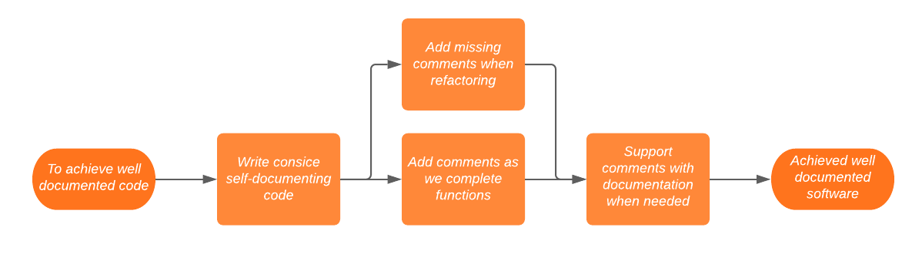
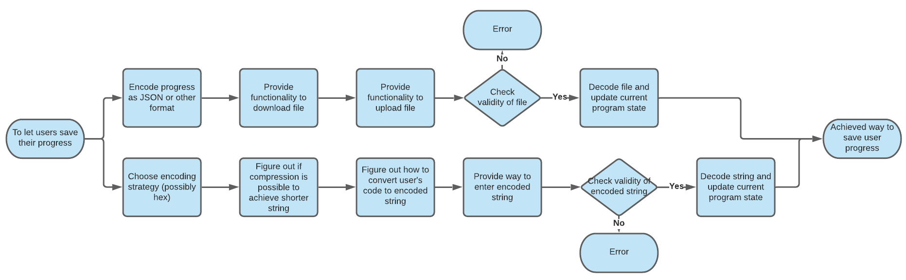

# Portfolio A

### Important Dates

 - Portfolio A needs to be completed by 11/11/20
 - MVP done by 9/12/20
 - Beta release 12/2/21
 - Final release 12/5/21

## Overview

## Requirements

### Stakeholders

#### Steve Bullock
Steve Bullock is our primary client and lead of the Drone Control project. He will be overseeing development during the project with us and maintenance or further development for the foreseeable future of the product whether that be with us or other parties.

User Stories:

1. As the client I want the software to be well documented so that it is extendable by original and future developers.
    - This can be achieved by keeping the code base clean and writing self-documenting code, when this is not possible detailed comments will be left. In-depth documentation will also be provided for when comments are not enough.

    
2. As the client I want the website to support a minimum of 50 concurrent users so that it can be used in a classroom setting.
    - We plan to use react to allow us to do a lot, if not all, of the processing in the users' browser, creating less of a load on our servers meaning it should be scalable to as many clients as necessary. 
3. As the client I want a way to save coding progress so that users can come back to their work or share work with other users.
    - Steve suggested the programs users create could be hashed/encrypted into a unique code to allow for easy sharing of work. This could likely be achieved as the users build programs using 'Scratch'-style blocks meaning there are limited possibilities for how a program is created. The unique code could use hexadecimal or similar to shorten the length of the codes while leaving us with enough data for all the possibilities.
    - To achieve this we need to decide on an encoding strategy and decide how blocks will be encoded with this, possibly looking at compression techniques to shorten code.#
    
4. As the client I want the website to remain online and usable for 5 years as to get maximum benefit to a large number of students.

#### Boeing
Boeing is not directly involved in the development progress, however, they support the project and if funding is required they will provide it. In future years if the software needs major changes or maintenance and we are not able to provide it, this may be outsourced to Boeing where they use internal staff or find external help.

User Stories:

1. As the investor I want the software to remain online and usable for 5 years so that a positive impact from the investment can be seen.
2. As the maintainer I want the software to be well documented and extendable so that in the future we can easily work on the software.

#### ILO (Industrial Liaison Office)
The ILO is acting as an intermediary between internal clients (Steve Bullock) and external (Boeing). This could extend into the future after the project is completed if we decide to continue maintaining the project and working with Boeing while we are students.

#### SRAA (Student Recruitment Access and Admissions)

SRAA via the faculty engagment officer (Roisin Quinn) will be the lead on outreach with the software, running  e with younger students to increase interest in programming and/or Engineering. The software is aimed at users age 11-16 with the possibility of making it accessible to users from age 6.

User Stories:

1. As the outreach lead I want the software to be accessible to users from age 11-16 so that a large range of students can take part (KS3 & KS4).
2. As the outreach lead I want the website to run on recent Chrome, Firefox, Safari on Win/Mac desktop as to allow as many users as possible to have easy access.

#### Users (Students)
The users of the website will be students ages 11-16, the difference in ability that could arise due to the age gap will be accounted for and increasing accessibility is a priority for this project.

User Stories:

1. As the user I want the website to be straightforward and easy to use so that I do not have to spend a lot of time learning how to use it.
2. As the user I want to have a large range of 'Scratch'-style code blocks to allow me to create more sophisticated programs. 

### Functional & Non-Functional Requirements

#### Functional

| Description | Requirement Met | Tested | Test Evidence |
|-------------|:-----------------:|:--------:|:--------:|
| Must run on recent Chrome, Firefox, Safari on Win/Mac desktop to increase accessibility | No | No |
| Support minimum 50 concurrent users, scalable to more to allow it to be used in larger classroom settings |  |
| Remain online and usable for 5 years |  |
| Have functionality to save users program progress |  |

#### Non-Functional

| Description | Requirement Met | Tested | Test Evidence |
|-------------|:-----------------:|:--------:|:--------:|
| Be accessible to users age 11-16 | No | No |  |
| Remain online and usable for 5 years by paying for hosting and domain for 5 years |  |  |
| Get students interesting in studying STEM |  |  |

## Design Documents

### Frontend Design

https://www.figma.com/proto/d4MiXZERsUpjWQ7Qkf0xbl/DRONE-CONTROL?node-id=1%3A3&scaling=min-zoom

Using react - possibly next.js to allow for a multi-page app?

Sketches of all pages
  - Login page?
  - Instruction/example page?
  - Main page with code & simulation (could be split to 2 pages)

Login page - will we use google login/similar?

### Backend Design

Java and springboot

### Database Design

If we don't have any user login probably no database needed?